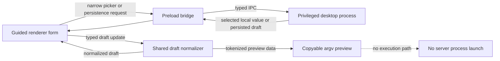

# Desktop foundation architecture

## Purpose

Minecraft Server Command Center is being established as a guided Material Design 3 desktop configuration surface for Minecraft servers. The foundation keeps configuration collection separate from server process control: it can shape a server draft and preview a direct argument vector, but it does not run the resulting command.

## Intended module boundaries

| Layer | Source path | Responsibility | Explicit limit |
| --- | --- | --- | --- |
| Shared draft | `src/shared/server-draft.ts` | Defines a schema-version-1 server draft, bounded normalization, and defaults. | Does not access the filesystem or spawn processes. |
| Shared bridge contract | `src/shared/desktop-api.ts` | Defines the limited draft, picker, typed-preview, catalog, update-boundary, and window-control API. | Does not define a process-launch method. |
| Draft persistence | `src/main/draft-store.ts` | Loads and writes `server-draft.v1.json` under Electron's `userData` directory after normalization. | Does not write into a selected Minecraft server directory. |
| Privileged desktop process | `src/main/index.ts` | Owns draft persistence, native picker requests, typed-preview/catalog retrieval, update-boundary state, custom window controls, and IPC handlers. | Does not expose an arbitrary command launcher. |
| Typed preview adapter | `src/main/argv-preview.ts` | Composes Java/JAR tokens with only the versioned Paper/Spigot registry's direct-array emitters. | Does not invoke a shell or start a process. |
| Catalog adapter | `src/main/cli-catalog.ts` | Projects the versioned Paper/Spigot catalog when present and otherwise returns a bounded visible fallback. | Does not accept arbitrary raw command input. |
| Update boundary | `src/main/update-boundary.ts` | Exposes an explicit unavailable automatic-update state. | Does not query a feed, download, stage, or install an update. |
| Preload bridge | `src/preload/index.ts` | Exposes the smallest typed renderer-facing API. | Does not expose unrestricted filesystem or process APIs. |
| Renderer document | `src/renderer/index.html` | Defines the custom title bar, vertical tab shell, guided form controls, preview panel, catalog panel, and explicit no-launch notice. | Does not contain privileged operations. |
| Renderer behavior | `src/renderer/main.ts` | Loads/saves the normalized draft, wires four picker kinds, renders direct argv tokens and the catalog, and keeps launch unavailable. | Does not execute a process or shell command. |
| Renderer presentation | `src/renderer/styles.css` | Supplies Material Design 3 color roles, shape, elevation, focus styling, reduced-motion handling, and responsive tab/form layouts. | Source styling only; it has not been rendered in a built application. |

All mappings above have source-only inspection evidence. This does not claim that any mapped file has compiled, packaged, or been interacted with in a built application.

## Data flow

The renderer should present a readable argv sequence and preserve token boundaries. A preview must never be joined into a shell command, interpreted as script text, or sent to a process-launch API merely because the user copied or edited it.

## Renderer surface boundary

The inspected renderer has seven vertically oriented setup tabs: Overview,
Runtime, World, Access, Paths, Start preview, and CLI catalog. It renders
bounded controls, direct argv tokens, mapped/unavailable catalog rows, local
draft status, and non-blocking save feedback. A disabled visible action states
that server launch is intentionally unavailable.

Input changes are normalized before they are scheduled for local draft
persistence. The renderer requests only the narrow preload API for draft
load/save, picker selection, catalog retrieval, and desktop-window controls.
This is source-only evidence; the tab behavior, feedback timing, and
accessibility semantics have not been exercised in a built application.

The inspected styles define Material Design 3 color-role, shape, and elevation
tokens; visible keyboard focus; a reduced-motion preference; responsive
navigation-rail collapse; and single-column form/preview layouts at constrained
widths. These declarations are source evidence only and are not proof of visual
layout, contrast, accessibility, or interaction behavior in a running build.

## Draft and persistence boundary

The configuration draft is typed and normalized before it is persisted or returned to the renderer. The inspected source defines schema version 1 and bounds text, paths, seed text, memory values, disk reserve, ports, booleans, and enumerated selections. Invalid or obsolete input falls back to allowed values rather than passing unchecked data through the UI.

The draft store serializes the normalized draft as UTF-8 JSON named `server-draft.v1.json` in Electron's `userData` directory. It writes a temporary file and renames it into place. This is source-only behavior documentation; no persistence behavior has been exercised.

Native local pickers belong behind the privileged desktop boundary. The inspected picker API supports only folder, server-JAR, Java executable, and configuration-file selection. The renderer may ask for one of those supported picker operations, but it does not receive broad local filesystem capability as a side effect.

The inspected desktop window is frameless and uses `contextIsolation: true`, `nodeIntegration: false`, and `sandbox: true`. These settings are source evidence only; they have not yet been observed in a built application.

## Catalog availability boundary

The catalog adapter checks for `src/shared/paper-spigot-cli-catalog.cjs` at runtime. If the module is absent, malformed, or cannot be loaded, the adapter returns a bounded fallback with visible shared-startup, Paper, and Spigot categories. The fallback identifies detailed Paper arguments and Spigot-specific pass-through as unavailable instead of accepting raw command text.

When a catalog module is present, the adapter normalizes its projected categories and entries to bounded counts and strings before returning them to the renderer. Catalog presence and runtime behavior remain unverified until the application is built and exercised.

## Typed-registry preview boundary

The typed-preview adapter uses only the versioned Paper/Spigot registry's
direct argument-array emitters. It requires the registry to state that it is
non-launching and shell-free before composing Java, managed JVM, JAR, and
selected server tokens. It has no local raw-flag list. For a Spigot target,
selections outside the registry's documented compatibility set remain visible
as omitted, rather than being guessed or passed through.

## Update boundary

The Squirrel.Windows packaging definition can produce unsigned artifacts, but
automatic updates are intentionally unavailable in this desktop foundation. It
has no verified update feed, integrity validation, download, staging,
restart-and-install, rollback, or unsaved-work recovery route. The renderer
receives this explicit unavailable status so packaging support is not
represented as a functioning update client.

## Lifecycle boundary

The inspected bridge exposes only draft load/save, four picker kinds, typed
preview/catalog retrieval, update-boundary status, and window-control methods.
It intentionally has no launch IPC and no server supervisor. The foundation
therefore does not claim any capability to start, stop, restart, attach to, or
modify a Paper or Spigot process. The command preview is planning data only.

A later lifecycle feature must define process ownership, cancellation, logging, configuration write timing, confirmation for consequential actions, failure recovery, and real application-level verification before it can cross this boundary.

## Related documentation

- [Paper and Spigot CLI guidance](../server-configuration/paper-spigot-cli.md)
- [Completeness inventory](../verification/completeness-inventory.md)
