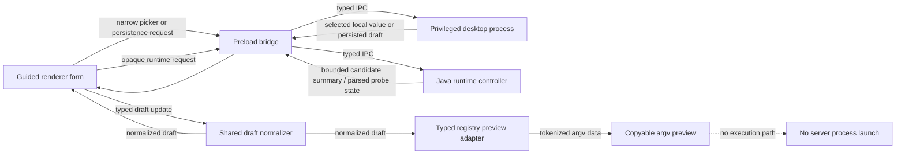

# Desktop foundation architecture

## Purpose

Minecraft Server Command Center is being established as a guided Material Design 3 desktop configuration surface for Minecraft servers. The foundation keeps configuration collection separate from server process control: it can shape a server draft and preview a direct argument vector, but it does not run the resulting command.

## Intended module boundaries

| Layer | Source path | Responsibility | Explicit limit |
| --- | --- | --- | --- |
| Shared draft | `src/shared/server-draft.ts` | Defines a schema-version-1 server draft, bounded normalization, and defaults. | Does not access the filesystem or spawn processes. |
| Shared bridge contract | `src/shared/desktop-api.ts` | Defines the limited draft, picker, Java-runtime summary, typed-preview, catalog, update-boundary, and window-control API. | Does not define a process-launch method or generic raw-path/process bridge. |
| Draft persistence | `src/main/draft-store.ts` | Loads and writes `server-draft.v1.json` under Electron's `userData` directory after normalization. | Does not write into a selected Minecraft server directory. |
| Privileged desktop process | `src/main/index.ts` | Owns draft persistence, native picker requests, typed-preview/catalog retrieval, update-boundary state, custom window controls, and IPC handlers. | Does not expose an arbitrary command launcher. |
| Java runtime controller | `src/main/java-runtime-controller.ts`, `src/main/java-runtime-manager.cjs` | Keeps Java candidate paths in the main process, performs bounded discovery and fixed direct version probing, and projects opaque candidate summaries plus review-only compatibility data. | Does not scan PATH/disks/registry recursively, fetch a Paper catalog, install Java, invoke a package manager, or start a server. |
| Typed preview adapter | `src/main/argv-preview.ts` | Composes Java/JAR tokens with only the versioned Paper/Spigot registry's direct-array emitters. | Does not invoke a shell or start a process. |
| Catalog adapter | `src/main/cli-catalog.ts` | Projects the versioned Paper/Spigot catalog when present and otherwise returns a bounded visible fallback. | Does not accept arbitrary raw command input. |
| Update boundary | `src/main/update-boundary.ts` | Exposes an explicit unavailable automatic-update state. | Does not query a feed, download, stage, or install an update. |
| Preload bridge | `src/preload/index.ts` | Exposes the smallest typed renderer-facing API. | Does not expose unrestricted filesystem or process APIs. |
| Renderer document | `src/renderer/index.html` | Defines the custom title bar, vertical tab shell, guided form controls, Java runtime candidate/assessment card, preview panel, catalog panel, and explicit no-launch notice. | Does not contain privileged operations or a Java-path text field. |
| Offline documentation registry | `src/renderer/offline-documentation-registry.ts`, `src/shared/offline-documentation.ts` | Bundles the hand-written non-site Markdown set, validates typed article bounds, searches local title/body text, resolves local article links, and renders one escaped Markdown subset. | Does not fetch URLs, read arbitrary paths, execute provider-authored markup, or include `docs/site/`. |
| Offline documentation renderer | `src/renderer/offline-documentation.ts` | Owns the Docs tab's local article list, plain-text search, bounded regex hook, article selection, and hash-only navigation through the shared renderer. | Does not add preload/main IPC, network access, analytics, secrets, or user-data persistence. |
| Renderer behavior | `src/renderer/main.ts` | Loads/saves the normalized draft, wires bounded runtime discovery, opaque candidate selection, direct-probe assessment rendering, direct argv tokens, the catalog, and the offline Docs tab while keeping launch unavailable. | Does not execute a process, shell command, installer, package manager, or configuration writer. |
| Renderer presentation | `src/renderer/styles.css` | Supplies Material Design 3 color roles, shape, elevation, focus styling, reduced-motion handling, and responsive tab/form layouts. | Source styling only; it has not been rendered in a built application. |
| Planner Handoff v1 envelope | src/shared/planner-handoff.ts | Defines the versioned, bounded, non-secret planning exchange shape and normalization boundary. | Does not carry paths, URLs, secrets, raw command text, file contents, or execution instructions. |

All mappings above have source-design inspection evidence. The offline
documentation mapping also has focused contract and root-build evidence from
this lane; no mapping claims a packaged launch, visual interaction, or capture.

## Data flow

The renderer should present a readable argv sequence and preserve token boundaries. A preview must never be joined into a shell command, interpreted as script text, or sent to a process-launch API merely because the user copied or edited it.

## Renderer surface boundary

The inspected renderer has nine vertically oriented setup tabs: Overview,
Runtime, World, Access, Paths, Start preview, CLI catalog, Docs, and Universal
settings. The Runtime tab
adds rich bounded-discovery and native-selection controls, opaque candidate
rows, a direct-version-probe action, a bounded Paper-target-catalog
status/count/provenance projection, explicit Spigot non-mapping, and review-only
plan state. It renders
bounded controls, direct argv tokens, mapped/unavailable catalog rows, local
draft status, and non-blocking save feedback. A disabled visible action states
that server launch is intentionally unavailable. The Docs tab presents the
typed offline article registry, local title/body search with plain text as the
default, an opt-in bounded regex hook, and local article-link navigation.

Input changes are normalized before they are scheduled for local draft
persistence. The renderer requests only the narrow preload API for draft
load/save, picker selection, bounded Java runtime discovery/selection/assessment,
catalog retrieval, and desktop-window controls.
This is source-only evidence; the tab behavior, feedback timing, and
accessibility semantics have not been exercised in a built application.

The Docs tab has no privileged bridge dependency. Vite imports the selected
desktop Markdown files as raw local assets at build time. The shared
`offline-documentation.ts` contract validates the typed registry, filters
searches locally, turns only registry-relative `.md` links into in-app
navigation, and escapes all rendered text. External links and media remain
visible as unavailable offline. The renderer subset is intentionally not a
full CommonMark implementation; see [Offline documentation browser
foundation](../reference/offline-documentation-browser.md) for the exact
limits and focused verification commands.

The inspected styles define Material Design 3 color-role, shape, and elevation
tokens; visible keyboard focus; a reduced-motion preference; responsive
navigation-rail collapse; and single-column form/preview layouts at constrained
widths. These declarations are source evidence only and are not proof of visual
layout, contrast, accessibility, or interaction behavior in a running build.

## Draft and persistence boundary

The configuration draft is typed and normalized before it is persisted or returned to the renderer. The inspected source defines schema version 1 and bounds text, paths, seed text, memory values, disk reserve, ports, booleans, and enumerated selections. Invalid or obsolete input falls back to allowed values rather than passing unchecked data through the UI.

The draft store serializes the normalized draft as UTF-8 JSON named `server-draft.v1.json` in Electron's `userData` directory. It writes a temporary file and renames it into place. This is source-only behavior documentation; no persistence behavior has been exercised.

Native local pickers belong behind the privileged desktop boundary. The generic picker API supports only folder, server-JAR, and configuration-file selection. The Runtime tab owns the separate Java-executable picker; its result goes directly into the main-process Java runtime controller, while the renderer receives only an opaque candidate ID and safe summary, not its executable path. The renderer may ask for one of the supported picker operations, but it does not receive broad local filesystem capability as a side effect.

The inspected desktop window is frameless and uses `contextIsolation: true`, `nodeIntegration: false`, and `sandbox: true`. These settings are source evidence only; they have not yet been observed in a built application.

## Planner Handoff v1 boundary

Planner Handoff v1 is a strictly local, user-mediated exchange between the
browser companion and the desktop planning draft. The browser does not call the
desktop application. Instead, a user chooses a local JSON export or import in
the browser and separately chooses the resulting .json file through a native
desktop picker.

The v1 plan contains only serverName, serverKind, minecraftVersion,
javaRuntime, memoryMiB, worldName, eulaAcknowledged, onlineMode, port,
rconEnabled, and rconPort. The supported Minecraft presets are 1.21.4, 1.20.6,
and 1.20.4. Java 21 is required for the first two presets and Java 17 for
1.20.4. Memory is an integer from 1024 through 32768 MiB in whole-GiB
increments. World values are the bounded world, creative-lab, and
adventure-hub presets. Ports are integers from 1 through 65535 and must differ
when RCON planning is enabled.

The shared envelope is versioned, bounded, typed, and non-secret. It
allows only those selected planning fields; it excludes local paths, URLs,
private server addresses, credentials, secrets, raw argument or command text,
file contents, opaque data, and arbitrary execution instructions. It is not a
Minecraft server configuration file and must never be used to write one.

The desktop flow is: native selected-file picker, privileged
main-process bounded read and parse, deterministic normalization, a safe
renderer preview for a valid exact v1 payload, and a separate explicit apply or
save action. Selecting or previewing a file does not mutate the current draft.
Applying a valid v1 plan overlays only the listed fields; local-only paths,
executable locations, seed, and other desktop-local draft values remain local.
Invalid, unsupported, oversized, malformed, or prohibited input fails closed
with generic rejection and no raw file-content disclosure, preview, partial
application, arbitrary filesystem traversal, configuration-file writes, server
operation, remote transfer, or process execution.

This is source-design documentation only. No selected-file interaction,
browser-local JSON flow, accessibility behavior, renderer preview, persistence
result, build, or packaged desktop runtime has been verified. See
[Planner Handoff v1](../site/planner-handoff-v1.md) for the full cross-surface
contract.

## Catalog availability boundary

The catalog adapter checks for `src/shared/paper-spigot-cli-catalog.cjs` at runtime. If the module is absent, malformed, or cannot be loaded, the adapter returns a bounded fallback with visible shared-startup, Paper, and Spigot categories. The fallback identifies detailed Paper arguments and Spigot-specific pass-through as unavailable instead of accepting raw command text.

When a catalog module is present, the adapter normalizes its projected categories and entries to bounded counts and strings before returning them to the renderer. Catalog presence and runtime behavior remain unverified until the application is built and exercised.

## Typed-registry preview boundary

The typed-preview adapter uses only the versioned Paper/Spigot registry's
direct argument-array emitters. It requires the registry to state that it is
non-launching and shell-free before composing the `java` placeholder, managed
JVM, JAR, and selected server tokens. The actual selected Java executable
remains in the privileged runtime-review controller and is not renderer input
to the preview. It has no local raw-flag list. For a Spigot target, selections
outside the registry's documented compatibility set remain visible as omitted,
rather than being guessed or passed through.

## Update boundary

The Squirrel.Windows packaging definition can produce unsigned artifacts, but
automatic updates are intentionally unavailable in this desktop foundation. It
has no verified update feed, integrity validation, download, staging,
restart-and-install, rollback, or unsaved-work recovery route. The renderer
receives this explicit unavailable status so packaging support is not
represented as a functioning update client.

## Lifecycle boundary

The inspected bridge exposes only draft load/save, three generic picker kinds,
bounded
Java runtime discovery/selection/assessment/clear requests, typed
preview/catalog retrieval, update-boundary status, and window-control methods.
It intentionally has no launch IPC and no server supervisor. The foundation
therefore does not claim any capability to start, stop, restart, attach to, or
modify a Paper or Spigot process. The command preview is planning data only.

A later lifecycle feature must define process ownership, cancellation, logging, configuration write timing, confirmation for consequential actions, failure recovery, and real application-level verification before it can cross this boundary.

## Related documentation

- [Paper and Spigot CLI guidance](../server-configuration/paper-spigot-cli.md)
- [Java runtime setup](../reference/java-runtime-setup.md)
- [Completeness inventory](../verification/completeness-inventory.md)
